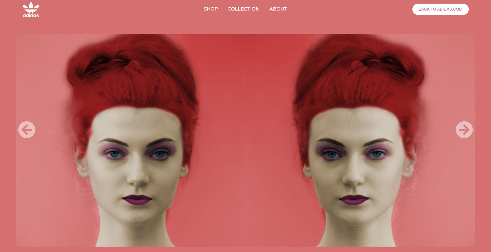
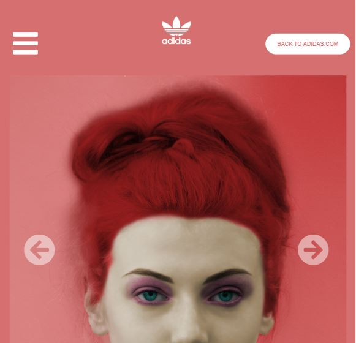
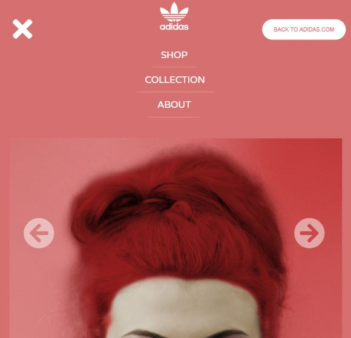

# Adidas Carousel Concept

This portfolio project showcases my advanced skills in React and CSS by presenting a visually stunning web application. The project features a dynamic double carousel, creating an immersive user experience and serving as a platform for me to refine and expand my proficiency in these technologies.

## Mobile and Screen Reader Friendly

The application has been designed to be mobile-friendly and accessible for screen readers, ensuring a seamless experience across different devices and for users with disabilities.

## Original Design Concept by Nathan Riley

The original design concept for this project was created by Nathan Riley. You can find the design on Dribbble at the following link: [Adicolor SS2018 Lookbook Carousel](https://dribbble.com/shots/4062487-Adicolor-SS2018-Lookbook-Carousel).

## Screenshots

### Desktop

### Mobile

### Mobile-Menu

## Live Demo

Check out the live demo of the project at the following link: [Adicolor Carousel Demo](https://adicolor-a834eb869af8.herokuapp.com/).

## Technology Used

The project utilizes the following technologies:

- React
- JSX
- HTML
- CSS
- JavaScript

Feel free to explore the project, and don't hesitate to reach out if you have any questions or feedback.
